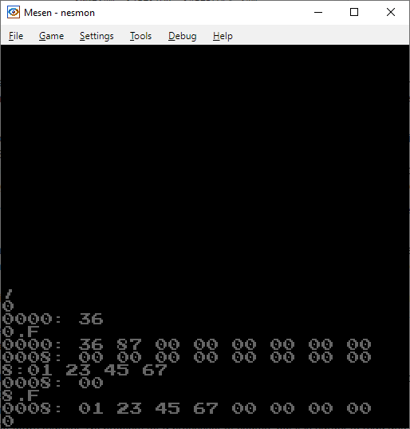

# nesmon
A port of Woz Monitor for the NES/Famicom based on the code and documation from https://www.sbprojects.net/projects/apple1/wozmon.php

Joypad controls have been **removed**. A fork that uses Joypad for input can be found at [https://github.com/TakuikaNinja/nesmon](https://github.com/TakuikaNinja/nesmon).

Input is now done through either a Family Basic Keyboard or using a compatible Keyboard Mouse Host interface (like pico-usbfamikb)



An imperfect version of the Test Program can be run by entering the following code

**Important**

The location of the ECHO subroutine in memory has changed. In the 25-01-12 build it was at 835E (5E 83), now it is at 8372 (72 83). The location in memory may change again so always check and only use the example code with the most recent builds.
```
0: A9 b 0 b AA b 20 b 72 b 83 b E8 b 8A (RET)
8: 4C b 2 b 0 (RET)
0 (RET)
R (RET)
```
b means blank or space; and (RET) hit the "return" key on the keyboard

It doesn't align properly due to window width and missing characters, but it works.

A longer program that prints a more compact list of ASCII chars is this one.
```
0: A9 b 8D b AA b 20 b 72 b 83 b E8 b E0 (RET)
8: EB b B0 b F5 b 8A b 4C b 2 b 0 (RET)
0 (RET)
R (RET)
```

An even longer program that displays a sprite that diagonaly moves across the screen is this one.
This one jumps to the VBWAIT subroutine at address 8394 (94 83), this could also change in new builds.
```
0: A2 b 4 b 8E b 1 b 2 b 8E b 2 b 2 (RET)
8: A2 b 0 b 8E b 0 b 2 b 8E b 3 b 2 (RET)
10:E8 b 20 b 94 b 83 b 4C b A b 0 (RET)
0 (RET)
R (RET)
```

It is possible to redirect the NMI and IRQ interrupts from 25-01-14 onward. The nmipointer at $07EE is used to select from one of four jump addresses in the following 8 bytes, $07EF to $07F6 and the irqpointer at $07F7 does the same for jump addresses from $07F8 to $07FF.

Bits 6 and 7 in the pointers select which jump address is taken.
```
b00###### - first address
b01###### - second address
b10###### - third address
b11###### - fourth address
```
This functionality should be used with care. Jumping to a malformed interrupt handler will likely cause the program to become unresponsive, if not crash the CPU.
